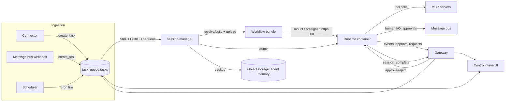

# Architecture

Agentic Ops is a workflow runtime and control plane for operational AI agents. This
document describes the components that ship in this repo and how a task moves
through them end to end.

## Components

### Gateway (`gateway/`)

The FastAPI control plane and the platform's single HTTP entry point. It
serves the `/api/*` control-plane API consumed by the UI (agents, tasks,
sessions, schedules, approvals, analytics, catalogs, and workflow-repo
sync/versioning), ingests message-bus webhooks, and collects the structured
event stream that runtime containers emit — persisting it as the session
timeline and updating task token/duration counters. It also brokers human
approvals, provisions agents by discovering `workflows/*/agent.yaml`, and runs
the cron scheduler that enqueues scheduled tasks.

### Session manager (`session-manager/`)

Consumes queued tasks and runs each to completion. It dequeues the oldest
eligible task with `SELECT ... FOR UPDATE SKIP LOCKED` (so replicas can share
one queue safely), resolves or builds the workflow bundle and its checksum,
assembles the runtime environment (decrypted secrets, platform config, model
profile), and launches a runtime container through a launcher abstraction that
supports Docker and Kubernetes. After a session it backs up
the agent's memory volume to object storage (and restores it before the next
run), and a periodic housekeeping pass archives/prunes old tasks and memory
versions.

### Runtime (`runtime/`)

The entrypoint executed inside every ephemeral agent container. Per session it:

1. Stages a writable `/workspace` from the read-only bundle source plus shared
   platform assets.
2. Resolves the workflow bundle (mounted path, or downloaded and extracted
   over https from a presigned object-storage URL) and verifies its checksum.
3. Builds the sandbox credential deny-list so declared secrets are unset for
   sandboxed Bash while remaining available to the parent process for MCP
   header expansion (see [Security](security.md)).
4. Spawns the Claude Agent SDK, streams its messages, and posts them to the
   gateway's event collector.
5. Runs a heartbeat loop, brokers tool-permission approvals and
   `AskUserQuestion` prompts through the gateway, and reports a final
   `session_complete` event with token/cost/turn totals.

### Control plane UI (`control-plane-ui/`)

Next.js app covering agents, tasks, session replay, schedules, approvals,
analytics, memory (Hindsight banks + agent memory), connectors, MCP catalog,
housekeeping history, and workflow-repo sync/versioning.

### Shared library (`shared/lib/`)

Code shared across the gateway, session manager, runtime, MCP servers, and
connectors. It owns the central `Settings` (see [Configuration](configuration.md)),
the database layer and ORM models, the task queue (`create_task` with alert
coalescing, `dequeue_task`, `complete_task`), the provider-neutral message bus
and object storage (`s3`/`gcs`) abstractions, workflow discovery, bundle
assembly, and the sync/version-pin/compatibility pipeline, plus secret loading
and age encrypt/decrypt.

### MCP servers and connectors

Covered in their own docs: [MCP servers](mcps.md) and [Connectors](connectors.md).

## Postgres schemas

| Schema | Holds |
| --- | --- |
| `task_queue` | `tasks` (queue state, prompt, metadata, coalescing) and `task_events` (append-only audit trail). |
| `control_plane` | `agents`, `sessions`, `session_events` (conversation replay), `approvals`, `schedules`, `background_job_runs`, `workflow_repo_state`. |
| `hindsight` | Owned by the external Hindsight service; the platform only reads/writes through its API. |

## Request/task flow

1. A task is created in `task_queue.tasks` (status `queued`) by a connector,
   a message-bus webhook, or the scheduler firing a cron-defined schedule.
2. session-manager dequeues it, resolves (or builds) the workflow's bundle,
   and launches a runtime container with the bundle contract env vars
   (`WORKFLOW_BUNDLE_PATH` / `WORKFLOW_BUNDLE_URI` / `WORKFLOW_BUNDLE_CHECKSUM`,
   see [Deployment](deployment.md)) plus decrypted secrets and runtime env.
3. The runtime stages its workspace, verifies the bundle checksum, and runs
   the Claude Agent SDK, calling MCP servers as tools and the message bus for
   human-visible output and clarification questions.
4. Tool calls that require approval create an `Approval` row and a message-bus
   prompt; a human's approve/reject decision is applied back through the
   gateway and unblocks the waiting runtime.
5. On completion, the runtime reports a `session_complete` event; session-manager
   marks the task `succeeded`/`failed` and backs up the agent's memory volume
   to object storage.
6. The control-plane UI reads task, session, approval, and analytics state
   from the gateway API throughout.
